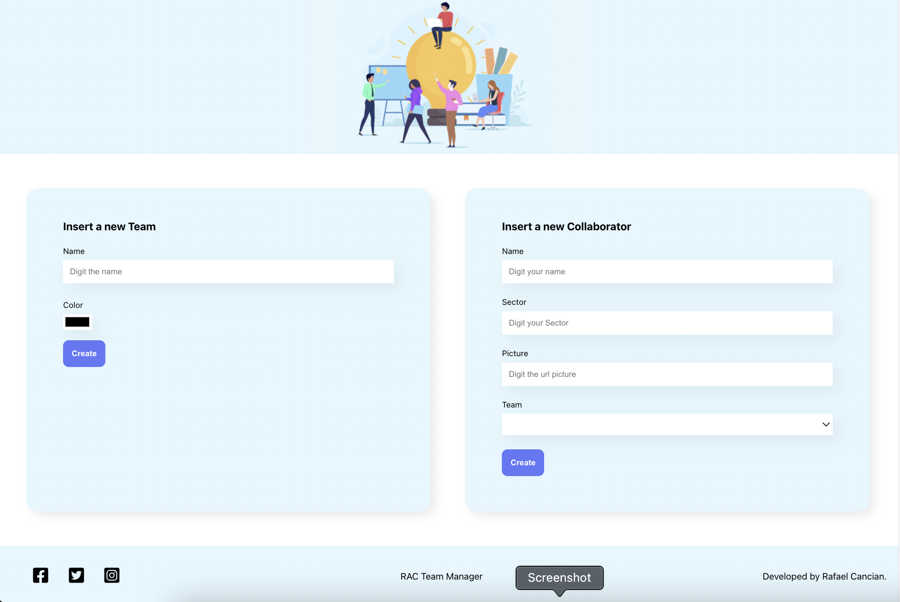
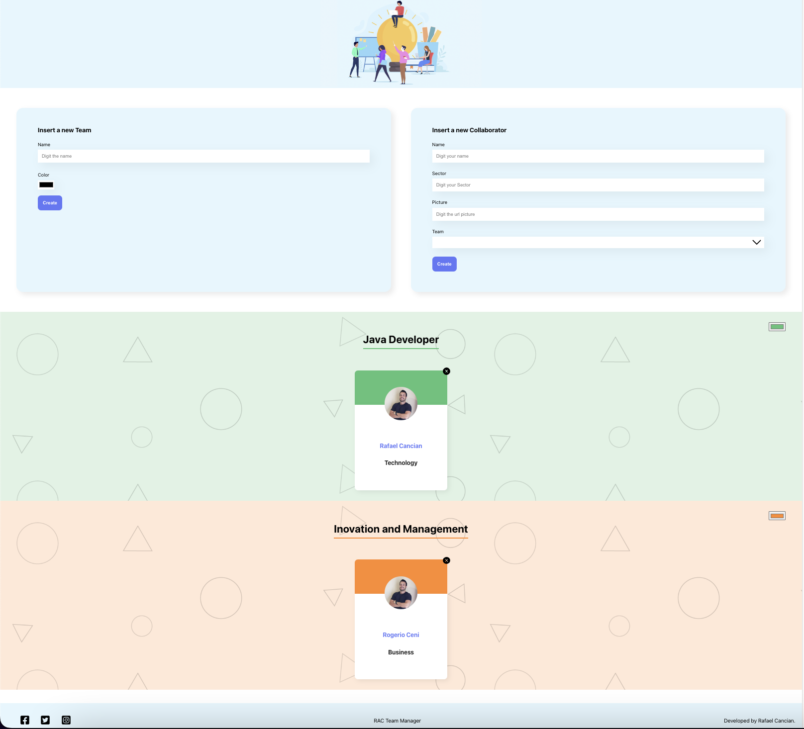

## RAC Team manager

Project created to register and manage the teams of a company

### Available Scripts

To run project execute
#### `npm install`
#### `npm start`

### Dependencies
Install React Icons
npm install react-icons --save
https://react-icons.github.io/react-icons/

Install hex to RGBA - used to set a second color in team members
npm i hex-to-rgba
https://www.npmjs.com/package/hex-to-rgba

Install UUID para gerar ids randomicamente
npm i uuid
https://www.npmjs.com/package/uuid

### Pictures
Home screen 

Screen after team registration
